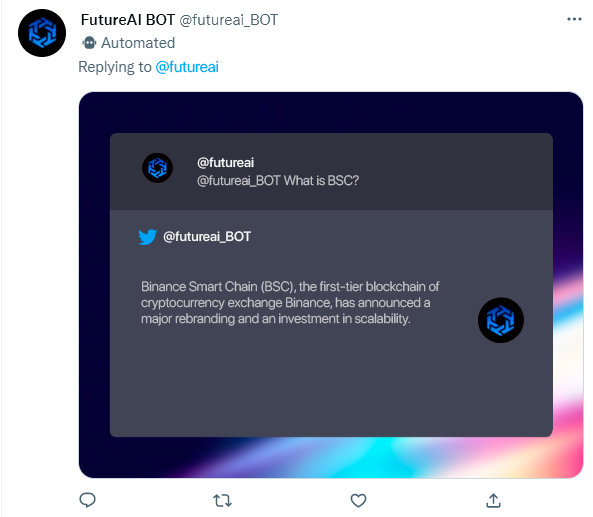
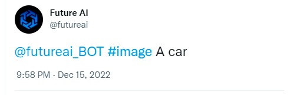

# 🔹 Twitter Bot

_We have in development a bot for twitter in which the same will have a huge weight for decision making on the platform, an important addendum, the bot will be totally free. We will use GDP-3 with text-based answers and also image generation. Its main function is to respond to tweets, either with images generated by AI or text._

_<mark style="color:blue;">Coming soon Twitter bot...</mark>_

_**A brief explanation of future usage:**_

_For requesting text answers, please bookmark our Twitter Bot and proceed with a question or statement:_

<figure><figcaption></figcaption></figure>

#### Our Twitter bot will respond:

<figure><figcaption></figcaption></figure>

#### We will have the option of image responses as well, just tag the future-AI Twitter bot followed by the image you want to see, like below:

<figure><figcaption></figcaption></figure>

#### And our image generator bot will respond as requested:

<figure><figcaption></figcaption></figure>
